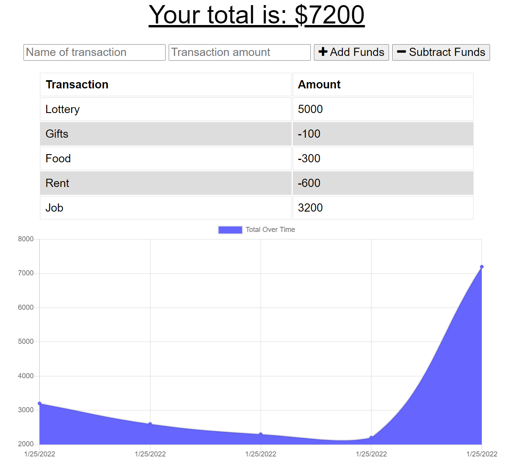

# Budget Tracker

Budget Tracker application gives users a fast and easy way to track money transactions. This app allows for offline access and functionality. Features `Mongoose`, `IndexedDB`, `Service Workers`, and `Web Manifest`.

## Table of Contents

* [Setup](#setup)
* [Usage](#usage)
* [Deployment](#deployment)
* [Contributing](#contributing)
* [License](#license)

## Setup
:floppy_disk:

The database uses the following npm:
- [Node Package Manager](https://nodejs.org/en/)
  - Run `npm install` in order to install the following npm package dependencies as specified in the `package.json`.
  - This will also help install express on your system and manage any other dependencies in your script.
- [Express](https://www.npmjs.com/package/express)
  - A minimal and flexible Node.js web application framework that provides a robust set of features to develop web and mobile applications. Facilitates the rapid development of Node based Web applications.
- [Mongoose](https://www.npmjs.com/package/mongoose)
  - Mongoose is a MongoDB object modeling tool designed to work in an asynchronous environment. Mongoose supports both promises and callbacks.

This repository uses the following server:

- [Heroku](https://heroku.com/)
  - A cloud application platform service that enables developers to build, run and operate applications entirely in the cloud.
- [MongoDB Atlas](https://www.mongodb.com/atlas/database)
  - Fully-managed cloud database that handles all the complexity of deploying, managing, and healing your deployments on the cloud service provider of your choice (AWS , Azure, and GCP). MongoDB Atlas is the best way to deploy, run, and scale MongoDB in the cloud.

## Usage

:computer:

Go to [Budget Tracker Heroku Deployed Site](https://budget-tracker-software.herokuapp.com/) to add or subtract transactions. User has the ability to enter deposits and expenses offline and will be added to the tracker when the application is brought back online.

Budget Tracker includes `Service Workers` to allow background scripts to run in the browser, separate from JavaScript. Also works with `IndexedDB` to persistently store data inside a user's browser.

Budget Tracker incorporates web manifest with the app's metadata, to let users' devices install an app to their chrome data found on [Chrome Apps](chrome://apps/). This currently works with Google Chrome browser.

If you cloned or copied the repository and want to host it on the local server, ensure that you `npm install` to download the packages. Start the server by inputting `npm start` in the terminal.

## Deployment

Server is deployed on Heroku through MongoDB Atlas. See deployed link to budget tracker.

[Deployed link to Budget Tracker](https://budget-tracker-software.herokuapp.com/)

## Contributing

:octocat:

[paperpatch](https://github.com/paperpatch)

## License

:receipt:

This project is licensed under MIT.